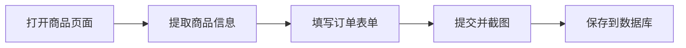
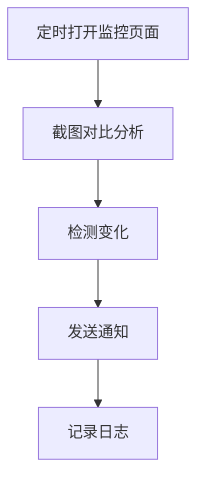
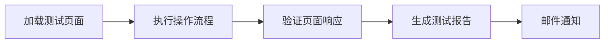

# 📚 Electron MCP Browser Automation

## 🎯 完整的浏览器自动化解决方案

> **Electron MCP** 是一个强大的浏览器自动化平台，集成了 AI 助手能力，为用户和开发者提供全面的自动化工具。

---

## 📖 文档导航

### 🚀 **快速开始**
- **[快速入门指南](./quick-start.md)** - 5分钟上手，感受自动化魅力
- **[安装与配置](./installation.md)** - 详细的安装步骤和环境配置
- **[第一个自动化脚本](./first-script.md)** - 从零到一，编写你的第一个自动化

### 🏗️ **系统架构**
- **[核心架构](./architecture.md)** - 系统架构图解，组件关系一目了然
- **[多账户系统](./multi-account.md)** - 账户隔离与管理机制详解
- **[RPC通信机制](./rpc-communication.md)** - 前后端通信的奥秘

### 🛠️ **开发指南**
- **[API参考手册](./api-reference.md)** - 完整的API文档，即查即用
- **[MCP工具集](./mcp-tools.md)** - AI集成的自动化工具箱
- **[窗口管理](./window-management.md)** - 浏览器窗口的完整控制
- **[屏幕自动化](./screen-automation.md)** - PyAutoGUI跨平台自动化指南

### 🎨 **实战案例**
- **[数据采集](./web-scraping.md)** - 网页数据抓取实战技巧
- **[表单填写](./form-automation.md)** - 自动填写网页表单的完整方案
- **[截图处理](./screenshot-processing.md)** - 智能截图与图像处理
- **[批量操作](./batch-operations.md)** - 大规模自动化任务的处理策略

### 📊 **高级功能**
- **[截图缓存系统](./screenshot-caching.md)** - 高效的图片缓存机制
- **[Cookie管理](./cookie-management.md)** - Cookie导入导出与会话保持
- **[网络请求监控](./network-monitoring.md)** - HTTP请求的追踪与分析
- **[安全机制](./security.md)** - 安全防护与权限管理

### 🔧 **运维部署**
- **[生产环境部署](./deployment.md)** - 从开发到生产的完整流程
- **[性能优化](./performance.md)** - 系统性能调优与监控
- **[故障排查](./troubleshooting.md)** - 常见问题解决方案
- **[日志分析](./logging.md)** - 日志系统与问题定位

### 📋 **参考资源**
- **[常见问题FAQ](./faq.md)** - 高频问题的权威解答
- **[最佳实践](./best-practices.md)** - 行业经验与开发规范
- **[更新日志](./changelog.md)** - 版本迭代与新特性追踪
- **[术语词典](./glossary.md)** - 技术术语的权威解释

---

## 🌟 核心特性

### 🎭 **多窗口管理**

```javascript
// 一行代码开启新窗口
await openWindow('https://example.com', { width: 1200, height: 800 });
```

### 🤖 **AI助手集成**

```javascript
// MCP工具自动调用AI能力
await mcpTools.aiAssist({
  action: 'extract_data',
  target: '.product-list'
});
```

### 📸 **智能截图系统**

```javascript
// 自动缓存的高质量截图
const screenshot = await captureScreenshot(windowId, { cache: true });
```

### 🔐 **安全隔离机制**

- 🔒 账户完全隔离
- 🛡️ 权限精细控制  
- 🔍 恶意URL拦截
- 📝 操作日志追踪

---

## 🚀 快速体验

### 💻 用户界面
```bash
# 启动应用
npm start
```


### 🔧 开发者API
```javascript
// 简单易用的API
const { openWindow, pyautoguiClick, screenshot } = require('./utils');

// 打开窗口 → 点击 → 截图
const win = await openWindow('https://github.com');
await pyautoguiClick(100, 200);
const screenshot = await screenshot(win.id);
```

### 🤖 AI助手对话
```markdown
用户: "帮我在这个页面提取所有产品信息"
AI: "我正在分析页面结构，已识别到15个产品，正在提取..."
```

---

## 📈 学习路径

### 🌱 **入门级** (1-2天)
- 📖 阅读：[快速入门指南](./quick-start.md)
- 🎯 实践：打开窗口、点击元素、截图保存
- 🏆 目标：完成第一个自动化脚本

### 🌿 **进阶级** (3-5天)
- 📖 阅读：[API参考手册](./api-reference.md)、[表单自动化](./form-automation.md)
- 🎯 实践：表单填写、数据提取、批量操作
- 🏆 目标：构建完整的数据采集流程

### 🌳 **高级级** (1-2周)
- 📖 阅读：[架构](./architecture.md)、[性能优化](./performance.md)、[安全](./security.md)
- 🎯 实践：多账户管理、错误处理、性能调优
- 🏆 目标：部署生产级自动化系统

---

## 🎨 使用场景

### 🛒 **电商自动化**


### 📊 **数据监控**


### 🎮 **Web测试**


---

## 🌟 社区生态

### 💬 **技术交流**
- 🔗 [GitHub Discussions](https://github.com/your-repo/discussions) - 技术问题讨论
- 💬 [Discord社群](https://discord.gg/your-channel) - 实时技术交流
- 🐦 [Twitter](https://twitter.com/your-handle) - 最新动态分享

### 📚 **资源推荐**
- 📖 [Electron官方文档](https://electronjs.org/docs)
- 🤖 [MCP协议规范](https://modelcontextprotocol.com)
- 🎭 [PyAutoGUI指南](https://pyautogui.readthedocs.io)

### 🎯 **案例展示**
- 🏪 [电商自动化案例集](./examples/ecommerce/)
- 📈 [数据监控模板](./examples/monitoring/)
- 🎮 [Web测试框架](./examples/testing/)

---

## 📞 获取帮助

### 🆘 **快速求助**
```javascript
// 内置帮助系统
console.log(help.info());
console.log(help.api('openWindow'));
```

### 📧 **联系渠道**
- 📧 **技术支持**: support@yourproject.com
- 🐛 **Bug报告**: [GitHub Issues](https://github.com/your-repo/issues)
- 📝 **功能建议**: [Feature Requests](https://github.com/your-repo/discussions)

### 🔍 **问题诊断**
```bash
# 系统诊断命令
npm run doctor
```


---

## 🚀 开始你的自动化之旅

> **"自动化不是为了取代人类，而是为了让人类专注于更有创造性的工作"**

### 🎯 **今日小目标**
1. 📖 花15分钟阅读[快速入门指南](./quick-start.md)
2. 🎯 完成你的第一个自动化脚本
3. 📸 成功截图保存到本地

### 🔮 **未来展望**
- 🌐 更多AI模型集成
- 📱 移动端自动化支持  
- 🔌 插件生态建设
- ☁️ 云端同步能力

---

**准备好改变你的工作方式了吗？让我们开始吧！** 🚀

> 💡 **提示**: 从左侧导航选择你感兴趣的章节，循序渐进地学习每个功能模块。

---

*📚 本文档持续更新，最新版本请访问 [在线文档](https://docs.yourproject.com)*