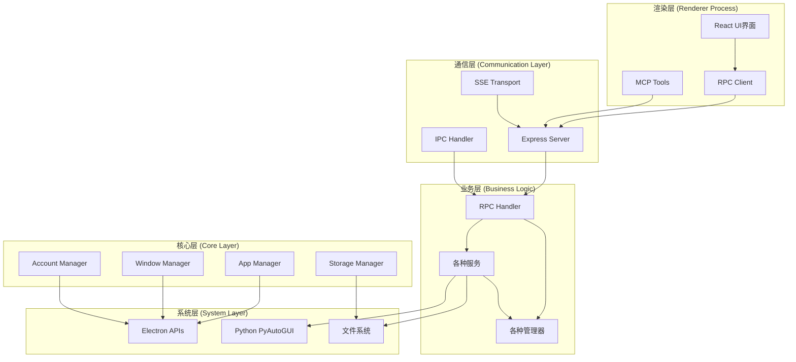
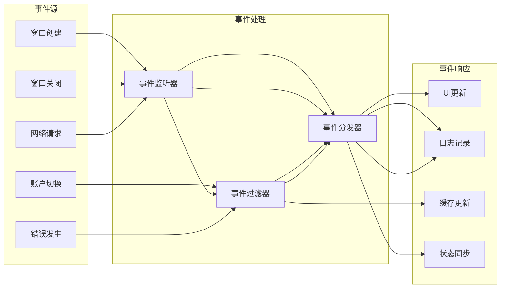
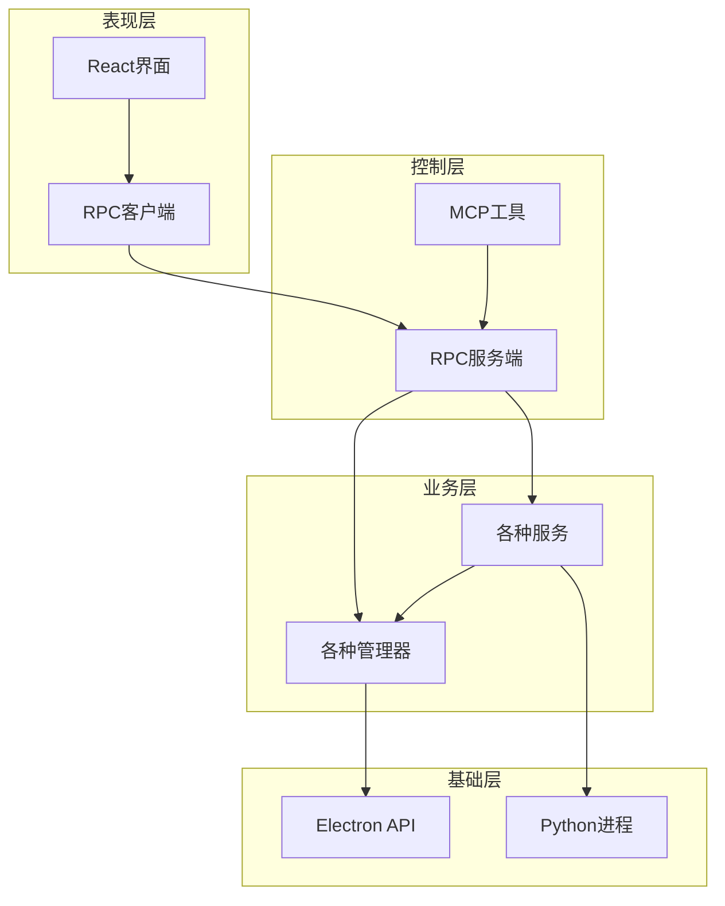

# 🏗️ 系统架构

## 核心组件关系与数据流

> 🎯 **目标**: 帮助开发者理解系统架构，快速定位问题

---

## 🌐 整体架构图



---

## 📦 核心组件详解

### 🎮 RPC Handler (请求处理中心)


**职责**: 统一处理所有API请求，负责路由到对应服务

```javascript
class RPCHandler {
  constructor() {
    // 核心管理器
    this.appManager = require("../core/app-manager");
    this.windowManager = require("../core/window-manager");
    this.accountManager = require("../core/account-manager");
    
    // 业务服务
    this.pyautoguiService = require("../services/pyautogui-service");
    this.screenshotCacheService = require("../services/screenshot-cache-service");
  }
  
  async handleMethod(method, params, context) {
    // 路由分发到具体处理逻辑
    switch (method) {
      case "openWindow": return this.windowManager.createWindow(...);
      case "pyautoguiClick": return this.pyautoguiService.click(...);
      // ... 60+ 其他方法
    }
  }
}
```

**特点**: 🎯 **单一入口** - 所有请求通过同一个入口处理

---

### 🪟 Window Manager (窗口管理核心)


**职责**: 管理所有浏览器窗口的生命周期和状态

```javascript
class WindowManager {
  constructor() {
    this.windows = new Map();  // 窗口ID到实例的映射
    this.windowStates = new Map();  // 窗口状态缓存
  }
  
  async createWindow(accountIndex, url, options, metadata) {
    const win = new BrowserWindow({
      webPreferences: {
        nodeIntegration: false,
        contextIsolation: true,
        preload: path.join(__dirname, 'preload.js')
      }
    });
    
    // 事件监听
    win.on('closed', () => this.removeWindow(win.id));
    win.on('focus', () => this.updateWindowState(win.id, 'focused'));
    
    this.windows.set(win.id, win);
    return win;
  }
  
  getWindow(windowId) {
    return this.windows.get(windowId);
  }
  
  getAllWindows() {
    const result = {};
    this.windows.forEach((win, id) => {
      result[id] = this.getWindowInfo(win);
    });
    return result;
  }
}
```

**特点**: 🔄 **状态管理** - 实时跟踪窗口状态变化

---

### 👤 Account Manager (多账户管理)


**职责**: 管理多用户账户，实现数据隔离

```javascript
class AccountManager {
  constructor() {
    this.accounts = new Map();  // 账户ID到账户数据的映射
    this.currentAccount = 0;  // 当前活跃账户
  }
  
  getAccount(accountIndex) {
    return this.accounts.get(accountIndex) || this.createDefaultAccount(accountIndex);
  }
  
  createAccountWindow(accountIndex, url) {
    const account = this.getAccount(accountIndex);
    
    return new BrowserWindow({
      webPreferences: {
        partition: `persist:session-${accountIndex}`,  // 独立存储分区
        userData: account.userDataPath  // 独立用户数据目录
      }
    });
  }
  
  switchAccount(accountIndex) {
    this.currentAccount = accountIndex;
    this.emit('account-changed', { oldAccount: this.currentAccount, newAccount: accountIndex });
  }
}
```

**特点**: 🔐 **完全隔离** - 每个账户独立的存储和会话

---

### 🖱️ PyAutoGUI Service (跨平台自动化)


**职责**: 提供跨平台的屏幕自动化能力

```javascript
class PyAutoGUIService {
  async executePyAutoGUICode(code, variables = {}) {
    return new Promise((resolve, reject) => {
      const pythonScript = `
import pyautogui
import sys
import json

# 安全设置
pyautogui.FAILSAFE = True
pyautogui.PAUSE = 0.1

# 执行用户代码
${code}
      `;
      
      const pythonProcess = spawn('python3', ['-c', pythonScript]);
      
      pythonProcess.on('close', (code) => {
        if (code === 0) resolve(stdout);
        else reject(new Error(`Python execution failed`));
      });
    });
  }
  
  async click(params = {}) {
    const { x, y } = params;
    const code = x && y ? `pyautogui.click(${x}, ${y})` : 'pyautogui.click()';
    return this.executePyAutoGUICode(code, { x, y });
  }
}
```

**特点**: 🌍 **跨平台** - Windows/macOS/Linux统一接口

---

### 📸 Screenshot Cache Service (截图缓存系统)


**职责**: 缓存截图数据，提升性能，减少重复操作

```javascript
class ScreenshotCacheService {
  constructor() {
    this.cache = new Map();  // 内存缓存
    this.cacheDir = path.join(os.tmpdir(), 'screenshot-cache');
    this.ttl = 60000;  // 缓存60秒
  }
  
  async capture(windowId, options = {}) {
    const cacheKey = this.generateCacheKey(windowId, options);
    const cached = this.getFromCache(cacheKey);
    
    if (cached && !this.isExpired(cached)) {
      console.log('📸 Using cached screenshot');
      return cached.data;
    }
    
    // 生成新截图
    const screenshot = await this.generateScreenshot(windowId);
    
    // 保存到缓存
    await this.saveToCache(cacheKey, screenshot);
    
    return screenshot;
  }
  
  generateCacheKey(windowId, options) {
    const hash = require('crypto')
      .createHash('md5')
      .update(`${windowId}-${JSON.stringify(options)}`)
      .digest('hex');
    return hash;
  }
}
```

**特点**: ⚡ **高性能** - 内存+磁盘双重缓存，显著提升响应速度

---

## 🔄 数据流详解

### 📋 请求处理流程
```mermaid
sequenceDiagram
    participant UI as 前端界面
    participant RPC as RPC处理
    participant WM as 窗口管理
    participant PA as PyAutoGUI
    participant FS as 文件系统
    
    UI->>RPC: openWindow(url, options)
    RPC->>WM: createWindow(account, url, options)
    WM->>WM: new BrowserWindow(config)
    WM->>WM: win.loadURL(url)
    WM->>RPC: return {id: 1, bounds: {...}}
    RPC->>UI: {ok: true, result: {id: 1, bounds: {...}}}
    
    UI->>RPC: pyautoguiClick(x, y)
    RPC->>PA: executePythonCode('pyautogui.click(x, y)')
    PA->>PA: python3 -c "import pyautogui; pyautogui.click(x, y)"
    PA->>RPC: execution result
    RPC->>UI: {ok: true, result: 'clicked'}
    
    UI->>RPC: captureScreenshot(winId, cache=true)
    RPC->>RPC: checkCache(cacheKey)
    alt 缓存命中
    RPC->>RPC: return cached result
    else 缓存未命中
    RPC->>WM: capturePage(winId)
    WM->>FS: save to file + cache
    FS->>RPC: file path
    RPC->>UI: {ok: true, result: {base64, format}}
```

### 🌐 事件传播机制


---

## 🏗️ 文件结构组织

### 📂 目录层次
```
app/
├── 📂 src/
│   ├── 🏗️ core/                    # 核心管理层
│   │   ├── app-manager.js          # 应用程序管理
│   │   ├── window-manager.js       # 窗口生命周期管理
│   │   ├── account-manager.js     # 多账户系统
│   │   ├── storage-manager.js     # 存储抽象层
│   │   └── menu-manager.js        # 菜单管理
│   │
│   ├── 🛠️ services/                 # 业务服务层
│   │   ├── pyautogui-service.js    # 屏幕自动化服务
│   │   ├── screenshot-cache-service.js # 截图缓存服务
│   │   └── window-open-handler.js  # window.open处理
│   │
│   ├── 🌐 server/                  # 服务器和API层
│   │   ├── express-server.js       # HTTP服务器
│   │   ├── rpc-handler.js         # RPC请求处理
│   │   └── mcp-integration.js    # MCP工具集成
│   │
│   └── 🔧 utils/                    # 工具函数库
│       ├── utils.js                # 通用工具函数
│       ├── utils-node.js          # Node.js专用工具
│       └── helpers.js             # 辅助函数
│
├── 🧪 tests/                       # 测试文件
│   ├── *.test.js                  # 单元测试
│   └── integration/               # 集成测试
│
└── 📚 docs/                        # 文档目录
    ├── api-reference.md          # API参考手册
    ├── architecture.md           # 架构文档
    └── quick-start.md           # 快速入门
```

### 🔄 组件依赖关系


---

## 🚀 性能优化策略

### ⚡ 内存管理
```javascript
// 对象池模式
class WindowPool {
  constructor() {
    this.pool = [];
    this.maxSize = 10;
  }
  
  acquire() {
    return this.pool.pop() || this.createNew();
  }
  
  release(window) {
    if (this.pool.length < this.maxSize) {
      // 清理重用
      window.webContents.clearHistory();
      this.pool.push(window);
    } else {
      // 销毁
      window.destroy();
    }
  }
}
```

### 🗄️ 懒加载
```javascript
// 按需加载模块
let pyautoguiService = null;

function getPyAutoGUIService() {
  if (!pyautoguiService) {
    console.log('🖱️ Loading PyAutoGUI service on demand...');
    pyautoguiService = require('./services/pyautogui-service');
  }
  return pyautoguiService;
}
```

### 📊 批处理优化
```javascript
// 批量操作合并
class BatchProcessor {
  constructor() {
    this.queue = [];
    this.timer = null;
  }
  
  add(operation) {
    this.queue.push(operation);
    this.scheduleBatch();
  }
  
  scheduleBatch() {
    if (this.timer) clearTimeout(this.timer);
    
    this.timer = setTimeout(async () => {
      const batch = this.queue.splice(0);
      await this.processBatch(batch);
    }, 50);  // 50ms批处理间隔
  }
}
```

---

## 🔐 安全机制

### 🛡️ 权限控制
```javascript
class SecurityManager {
  constructor() {
    this.permissions = new Map();
    this.setupDefaultPermissions();
  }
  
  checkPermission(operation, context) {
    const perm = this.permissions.get(operation);
    return perm && this.validateContext(perm, context);
  }
  
  setupDefaultPermissions() {
    this.permissions.set('openWindow', {
      allowedRoles: ['user', 'admin'],
      maxConcurrent: 10,
      timeRestriction: { start: '09:00', end: '21:00' }
    });
    
    this.permissions.set('screenshot', {
      allowedRoles: ['admin'],
      requireConfirmation: true,
      auditLog: true
    });
  }
}
```

### 🔍 输入验证
```javascript
class InputValidator {
  static validateURL(url) {
    const patterns = {
      malicious: [/^javascript:/, /^data:/],
      allowed: [/^https?:\/\/[\w.-]+\.[\w]{2,}/]
    };
    
    return patterns.malicious.every(p => !p.test(url)) &&
           patterns.allowed.some(p => p.test(url));
  }
  
  static validateCoordinates(x, y) {
    return Number.isInteger(x) && Number.isInteger(y) &&
           x >= 0 && y >= 0 &&
           x <= this.getScreenWidth() &&
           y <= this.getScreenHeight();
  }
}
```

---

## 📊 监控与诊断

### 📈 性能监控
```javascript
class PerformanceMonitor {
  constructor() {
    this.metrics = new Map();
    this.startTime = Date.now();
  }
  
  track(operation, duration) {
    if (!this.metrics.has(operation)) {
      this.metrics.set(operation, { count: 0, totalTime: 0, avgTime: 0 });
    }
    
    const metric = this.metrics.get(operation);
    metric.count++;
    metric.totalTime += duration;
    metric.avgTime = metric.totalTime / metric.count;
    
    // 异常检测
    if (duration > metric.avgTime * 3) {
      console.warn(`🚨 Performance anomaly detected: ${operation} took ${duration}ms`);
    }
  }
  
  getReport() {
    return {
      uptime: Date.now() - this.startTime,
      operations: Object.fromEntries(this.metrics),
      memoryUsage: process.memoryUsage(),
      activeWindows: this.windowManager.getAllWindows().length
    };
  }
}
```

### 🔧 故障诊断
```javascript
class DiagnosticTool {
  static async runFullDiagnosis() {
    const results = {
      system: await this.checkSystem(),
      dependencies: await this.checkDependencies(),
      permissions: await this.checkPermissions(),
      network: await this.checkNetwork()
    };
    
    const healthScore = this.calculateHealthScore(results);
    
    return {
      ...results,
      healthScore,
      recommendations: this.generateRecommendations(results)
    };
  }
  
  static async checkDependencies() {
    return {
      python: await this.checkPython(),
      pyautogui: await this.checkPyAutoGUI(),
      electron: process.versions.electron,
      node: process.versions.node
    };
  }
}
```

---

## 📚 相关文档

- 📖 [API参考手册](./api-reference.md) - 详细API文档
- 🎯 [多账户系统](./multi-account.md) - 账户管理详解
- 🖱️ [屏幕自动化](./screen-automation.md) - PyAutoGUI使用指南
- 📸 [截图缓存](./screenshot-caching.md) - 缓存系统详解

---

**💡 理解架构是高效开发的第一步！**

> 🚀 **基于这个架构，你可以轻松扩展功能、定位问题、优化性能**

---

*架构文档随代码演进持续更新*