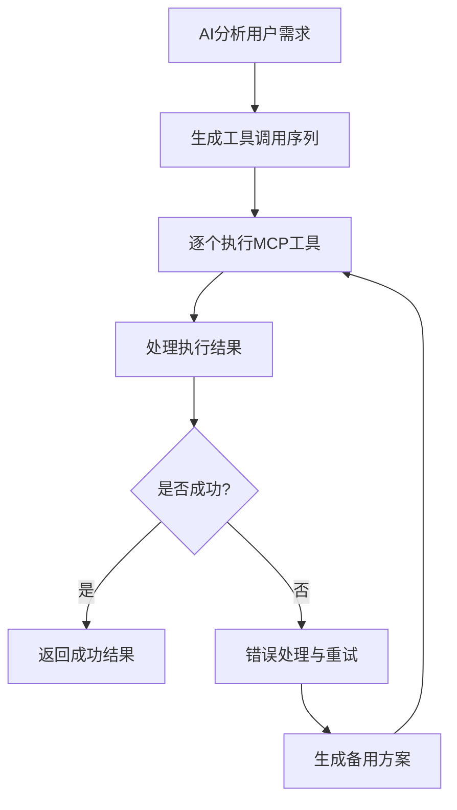

# 🤖 MCP 工具集

## AI助手集成的自动化工具箱

> 🎯 **目标**: 为AI助手提供完整的浏览器自动化能力，实现智能化的网页操作

---

## 📦 工具分类总览

### 🖱️ **窗口管理工具**
| 工具名 | 功能描述 | 参数 | 示例 |
|--------|----------|------|------|
| `open_window` | 打开新浏览器窗口 | url, account_index, options | `{"url": "https://github.com"}` |
| `close_window` | 关闭指定窗口 | window_id | `{"window_id": 1}` |
| `get_windows` | 获取所有窗口列表 | {} | `{}` |
| `show_window` | 显示隐藏的窗口 | window_id | `{"window_id": 1}` |
| `hide_window` | 隐藏窗口 | window_id | `{"window_id": 1}` |


---

### 🖱️ **页面操作工具**
| 工具名 | 功能描述 | 参数 | 示例 |
|--------|----------|------|------|
| `load_url` | 在窗口中加载新页面 | window_id, url | `{"window_id": 1, "url": "https://example.com"}` |
| `execute_javascript` | 执行页面脚本 | window_id, code | `{"window_id": 1, "code": "document.title"}` |
| `get_page_title` | 获取页面标题 | window_id | `{"window_id": 1}` |
| `get_element_rect` | 获取元素位置 | window_id, selector | `{"window_id": 1, "selector": "#login-btn"}` |


---

### 🖱️ **屏幕自动化工具**
| 工具名 | 功能描述 | 参数 | 示例 |
|--------|----------|------|------|
| `pyautogui_click` | 鼠标点击 | x, y | `{"x": 300, "y": 400}` |
| `pyautogui_type` | 键盘输入 | text | `{"text": "Hello World"}` |
| `pyautogui_press` | 按键操作 | key | `{"key": "enter"}` |
| `pyautogui_hotkey` | 组合键 | keys | `{"keys": ["ctrl", "c"]}` |
| `pyautogui_move` | 鼠标移动 | x, y | `{"x": 500, "y": 300}` |
| `pyautogui_screenshot` | 屏幕截图 | {} | `{}` |


---

### 📸 **截图工具**
| 工具名 | 功能描述 | 参数 | 示例 |
|--------|----------|------|------|
| `capture_screenshot` | 窗口截图 | window_id, options | `{"window_id": 1, "format": "png"}` |
| `capture_system_screenshot` | 全屏截图 | options | `{"format": "jpeg", "quality": 80}` |
| `get_screenshot_info` | 获取截图信息 | window_id | `{"window_id": 1}` |
| `save_screenshot` | 保存截图到文件 | window_id, file_path | `{"window_id": 1, "file_path": "/tmp/screenshot.png"}` |


---

### 🔐 **安全与权限工具**
| 工具名 | 功能描述 | 参数 | 示例 |
|--------|----------|------|------|
| `import_cookies` | 导入Cookie | window_id, cookies | `{"window_id": 1, "cookies": [...]}` |
| `export_cookies` | 导出Cookie | window_id, options | `{"window_id": 1, "format": "json"}` |
| `set_user_agent` | 设置用户代理 | window_id, user_agent | `{"window_id": 1, "user_agent": "Custom-Agent/1.0"}` |

---

## 🎯 使用示例

### 💬 AI对话场景
```markdown
用户: "帮我在GitHub上登录账号"

AI: 我将帮你在GitHub上完成登录操作：

1. 🖱️ 首先打开GitHub登录页面
2. 🔍 输入用户名和密码
3. 👆 点击登录按钮
4. 📸 验证登录成功
5. 🎉 完成登录流程

让我开始执行：
```

### 🤖 工具调用示例
```javascript
// AI助手自动调用的工具序列
const tools = [
  {
    tool: "open_window",
    arguments: {
      url: "https://github.com/login",
      account_index: 0
    }
  },
  {
    tool: "pyautogui_click",
    arguments: { x: 300, y: 200 }
  },
  {
    tool: "pyautogui_type",
    arguments: { text: "your-username" }
  },
  {
    tool: "pyautogui_press",
    arguments: { key: "tab" }
  },
  {
    tool: "pyautogui_type",
    arguments: { text: "your-password" }
  },
  {
    tool: "pyautogui_click",
    arguments: { x: 400, y: 300 }
  },
  {
    tool: "capture_screenshot",
    arguments: { window_id: 1 }
  }
];
```

### 🔄 复杂操作流程


---

## 🛠️ 高级工具组合

### 📊 数据采集工作流
```javascript
// AI生成的复杂工作流
const dataExtractionFlow = [
  // 1. 打开目标页面
  {
    tool: "open_window",
    arguments: { url: "https://ecommerce.com/products" }
  },
  
  // 2. 等待页面加载
  {
    tool: "execute_javascript",
    arguments: {
      window_id: 1,
      code: "return new Promise(resolve => setTimeout(() => resolve(document.readyState), 3000))"
    }
  },
  
  // 3. 获取所有商品链接
  {
    tool: "execute_javascript",
    arguments: {
      window_id: 1,
      code: `
        const products = [];
        document.querySelectorAll('.product-item').forEach(item => {
          products.push({
            title: item.querySelector('h3').textContent,
            price: item.querySelector('.price').textContent,
            url: item.querySelector('a').href
          });
        });
        return products;
      `
    }
  },
  
  // 4. 滚动页面加载更多
  {
    tool: "pyautogui_press",
    arguments: { key: "page_down" }
  },
  
  // 5. 截图记录当前状态
  {
    tool: "capture_screenshot",
    arguments: { 
      window_id: 1,
      options: { timestamp: true }
    }
  }
];
```

### 🎮 表单自动化
```javascript
// 智能表单填写
const formAutomation = [
  {
    tool: "open_window",
    arguments: { url: "https://registration.example.com" }
  },
  
  // AI自动识别表单字段
  {
    tool: "get_element_rect",
    arguments: { 
      window_id: 1,
      selector: "#username-input" 
    }
  },
  
  // 填写用户信息
  {
    tool: "pyautogui_click",
    arguments: { x: 250, y: 150 }
  },
  {
    tool: "pyautogui_type",
    arguments: { text: "john.doe@example.com" }
  },
  {
    tool: "pyautogui_press",
    arguments: { key: "tab" }
  },
  {
    tool: "pyautogui_type",
    arguments: { text: "SecurePassword123!" }
  },
  
  // 处理验证码（如果有）
  {
    tool: "capture_screenshot",
    arguments: { window_id: 1 }
  }
];
```

### 🔄 监控与检查
```javascript
// 定期监控任务
const monitoringTask = [
  // 打开监控页面
  {
    tool: "open_window",
    arguments: { url: "https://dashboard.example.com" }
  },
  
  // 等待登录
  {
    tool: "execute_javascript",
    arguments: {
      window_id: 1,
      code: `
        return new Promise(resolve => {
          const checkLogin = () => {
            const userElement = document.querySelector('.user-info');
            if (userElement) {
              resolve({
                user: userElement.textContent,
                time: new Date().toISOString()
              });
            } else {
              setTimeout(checkLogin, 5000);
            }
          };
          checkLogin();
        });
      `
    }
  },
  
  // 检查关键指标
  {
    tool: "execute_javascript",
    arguments: {
      window_id: 1,
      code: `
        return {
          title: document.title,
          url: location.href,
          performance: performance.now(),
          errorCount: document.querySelectorAll('.error').length
        };
      `
    }
  },
  
  // 保存监控报告
  {
    tool: "capture_screenshot",
    arguments: { 
      window_id: 1,
      options: { 
        format: "png",
        quality: 90
      }
    }
  }
];
```

---

## 🎨 工具参数详解

### 🪟 基础参数类型
```typescript
// 窗口操作参数
interface WindowParams {
  url: string;              // 网页地址
  account_index?: number;      // 账户索引（0-9）
  options?: {               // 窗口选项
    width?: number;          // 窗口宽度
    height?: number;         // 窗口高度
    x?: number;            // X坐标
    y?: number;            // Y坐标
    show?: boolean;        // 是否显示
    webPreferences?: {      // Web偏好设置
      nodeIntegration?: boolean;
      contextIsolation?: boolean;
    }
  };
}

// 自动化操作参数
interface AutomationParams {
  x?: number;              // X坐标（鼠标操作）
  y?: number;              // Y坐标（鼠标操作）
  text?: string;            // 输入文本
  key?: string;             // 按键名称
  keys?: string[];          // 组合键数组
  delay?: number;           // 操作延迟（毫秒）
  interval?: number;         // 重复间隔（毫秒）
}
```

### 🎯 高级参数配置
```typescript
// 截图参数
interface ScreenshotParams {
  window_id?: number;        // 窗口ID
  format?: 'png' | 'jpeg'; // 图片格式
  quality?: number;          // 图片质量（1-100）
  full_page?: boolean;       // 是否全页截图
  selector?: string;         // 元素选择器
  scroll?: boolean;         // 是否滚动截图
  cache?: boolean;          // 是否启用缓存
  ttl?: number;            // 缓存生存时间（秒）
}

// 执行脚本参数
interface ExecuteScriptParams {
  window_id: number;                    // 窗口ID
  code: string;                          // JavaScript代码
  return_value?: boolean;                 // 是否返回值
  timeout?: number;                       // 超时时间（毫秒）
  await_result?: boolean;                 // 等待Promise结果
}
```

---

## 🔄 工具链式调用

### ⚡ 并发执行
```javascript
// 同时打开多个页面进行并发处理
const concurrentTasks = [
  {
    tool: "open_window",
    arguments: { url: "https://site1.com/page1" }
  },
  {
    tool: "open_window", 
    arguments: { url: "https://site2.com/page2" }
  },
  {
    tool: "open_window",
    arguments: { url: "https://site3.com/page3" }
  }
];

// AI智能并发调度
const results = await Promise.all(
  concurrentTasks.map(task => mcpToolExecutor.execute(task))
);
```

### 🔄 条件执行
```javascript
// 基于条件的工具选择
const conditionalFlow = {
  // 条件检查
  condition: {
    tool: "execute_javascript",
    arguments: {
      window_id: 1,
      code: "return document.querySelector('.error-message') !== null"
    }
  },
  
  // 成功分支
  then_branch: [
    {
      tool: "capture_screenshot",
      arguments: { window_id: 1, options: { tag: "error-state" } }
    }
  ],
  
  // 失败分支  
  else_branch: [
    {
      tool: "pyautogui_click",
      arguments: { x: 300, y: 200 }
    },
    {
      tool: "pyautogui_type",
      arguments: { text: "success" }
    }
  ]
};
```

### 🔄 循环执行
```javascript
// 批量数据处理循环
const batchProcessing = {
  // 循环配置
  loop: {
    type: "while",              // while/for/range
    condition: {
      tool: "execute_javascript",
      arguments: {
        window_id: 1,
        code: "return document.querySelectorAll('.item:not(.processed)').length > 0"
      }
    },
    max_iterations: 50      // 最大循环次数
  },
  
  // 循环体
  body: [
    {
      tool: "pyautogui_click",
      arguments: { x: 400, y: 200 }  // 点击"处理"按钮
    },
    {
      tool: "pyautogui_press",
      arguments: { key: "tab" }       // 跳到下一个
    }
  ]
};
```

---

## 🛡️ 错误处理机制

### 🔄 自动重试策略
```javascript
// 智能重试配置
const retryConfig = {
  max_attempts: 3,              // 最大重试次数
  backoff_factor: 2,            // 退避因子
  initial_delay: 1000,          // 初始延迟
  retry_conditions: [            // 重试条件
    "timeout",
    "network_error", 
    "element_not_found"
  ]
};

// AI自动重试执行
await mcpToolExecutor.executeWithRetry(toolCall, retryConfig);
```

### 🔄 回滚机制
```javascript
// 操作失败时的回滚
const rollbackStrategy = {
  // 记录操作前的状态
  snapshot: {
    tool: "capture_screenshot",
    arguments: { window_id: 1, tag: "before-operation" }
  },
  
  // 主要操作
  operation: [
    {
      tool: "pyautogui_type",
      arguments: { text: "important-data" }
    },
    {
      tool: "pyautogui_press", 
      arguments: { key: "enter" }
    }
  ],
  
  // 失败时回滚
  rollback: {
    tool: "execute_javascript",
    arguments: {
      window_id: 1,
      code: "document.querySelector('input').value = '';"
    }
  }
};
```

---

## 📊 性能监控

### ⚡ 执行时间跟踪
```javascript
// AI性能监控
const performanceTracker = {
  // 开始跟踪
  start_tracking: {
    tool: "execute_javascript",
    arguments: {
      window_id: 1,
      code: "performance.mark('operation-start')"
    }
  },
  
  // 结束跟踪
  end_tracking: {
    tool: "execute_javascript", 
    arguments: {
      window_id: 1,
      code: `
        performance.mark('operation-end');
        performance.measure('operation-duration', 'operation-start', 'operation-end');
        return performance.getEntriesByName('operation-duration')[0].duration;
      `
    }
  }
};
```

### 📊 资源使用监控
```javascript
// 资源监控工具
const resourceMonitor = {
  check_memory_usage: {
    tool: "execute_javascript",
    arguments: {
      code: `
        return {
          used: performance.memory.usedJSHeapSize,
          total: performance.memory.totalJSHeapSize,
          limit: performance.memory.jsHeapSizeLimit
        };
      `
    }
  },
  
  check_network_status: {
    tool: "execute_javascript",
    arguments: {
      code: `
        return navigator.onLine ? 'online' : 'offline';
      `
    }
  }
};
```

---

## 🎨 最佳实践

### 🧪 测试驱动开发
```javascript
// 为每个工具调用生成测试
const generateTestForTool = (toolCall) => {
  return {
    test_name: `test_${toolCall.tool}_functionality`,
    test_steps: [
      `准备测试环境`,
      `调用 ${toolCall.tool} 工具`,
      `验证返回结果`,
      `清理测试环境`
    ],
    expected_results: {
      success: true,
      data_format: "expected_format"
    }
  };
};
```

### 📝 详细日志记录
```javascript
// AI操作日志标准
const logStandard = {
  level: "INFO",
  timestamp: new Date().toISOString(),
  ai_session_id: "session-123",
  user_request: "帮我在页面登录",
  tool_sequence: [
    { tool: "open_window", status: "success", duration: 1200 },
    { tool: "pyautogui_click", status: "success", duration: 300 },
    { tool: "pyautogui_type", status: "success", duration: 800 }
  ],
  overall_result: "success",
  user_satisfaction: "high"
};
```

---

## 🔗 相关资源

- 📖 [API参考手册](./api-reference.md) - 详细的API文档
- 🏗️ [系统架构](./architecture.md) - 理解底层原理  
- 🖱️ [屏幕自动化](./screen-automation.md) - PyAutoGUI详细指南
- 🎮 [表单自动化](./form-automation.md) - 复杂表单处理方案

---

## 🚀 开始使用

### 💻 基础集成
```javascript
// 初始化MCP工具集
const mcpTools = require('./src/server/mcp-integration');

// 注册自定义工具
mcpTools.registerTool('custom_automation', 
  '自定义自动化工具', 
  { input: 'string', action: 'string' },
  async ({ input, action }) => {
    // 自定义逻辑
    return { result: `执行 ${action} 成功` };
  }
);
```

### 🤖 AI助手配置
```javascript
// AI助手集成配置
const aiConfig = {
  model: "gpt-4",
  tools: [
    "open_window",
    "pyautogui_click", 
    "pyautogui_type",
    "execute_javascript",
    "capture_screenshot"
  ],
  capabilities: [
    "web_automation",
    "screen_automation", 
    "form_filling",
    "data_extraction"
  ]
};
```

---

**💡 让AI助手为你执行自动化任务吧！**

> 🤖 **丰富的工具集 + 智能AI = 强大的自动化能力**

---

*MCP工具集持续更新，更多工具正在开发中*