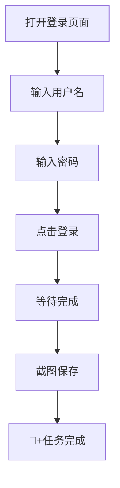

# 🚀 快速入门指南

## 5分钟上手 Electron MCP

> 💡 **目标**: 让你在5分钟内体验自动化威力，无需深入技术细节

---

## 🎯 第一步：安装启动

### 📦 安装依赖
```bash
# 克隆项目
git clone https://github.com/your-repo/electron-mcp.git
cd electron-mcp/app

# 安装依赖
npm install

# 全局安装 pyautogui
pip3 install pyautogui
```

### 🚀 启动应用
```bash
# 启动 Electron 应用
npm start
```


---

## 🖱️ 第二步：基础操作

### 📖 打开新窗口
```javascript
// 打开浏览器窗口
const { openWindow } = require('./src/utils');

async function demo() {
  // 打开 GitHub
  const win = await openWindow('https://github.com');
  console.log('✅ 新窗口ID:', win.result.id);
}
```


### 🖱️ 鼠标点击自动化
```javascript
const { pyautoguiClick } = require('./src/utils');

// 在指定位置点击
await pyautoguiClick(300, 400);
console.log('✅ 鼠标点击完成');
```


### 📸 截图保存
```javascript
const { captureScreenshot } = require('./src/utils');

// 截取屏幕并保存
const screenshot = await captureScreenshot(windowId);
const fs = require('fs');
fs.writeFileSync('my-screenshot.png', Buffer.from(screenshot.result, 'base64'));
console.log('✅ 截图已保存');
```


---

## 🤖 第三步：AI助手体验

### 💬 与AI对话
```javascript
// 使用AI助手自动化
const aiResponse = await mcpTools.aiAssist({
  task: '提取这个页面的所有链接',
  context: '新闻列表页面'
});

console.log('🤖 AI回复:', aiResponse);
```


### 🎯 智能选择器
```javascript
// AI自动定位元素
const elements = await aiLocate({
  description: '登录按钮',
  pageContent: await getPageContent()
});

console.log('🎯 找到元素:', elements);
```


---

## 🔄 第四步：组合工作流

### 📋 完整的自动化流程
```javascript
// 组合多个动作形成工作流
async function loginAndScreenshot() {
  try {
    // 1. 打开登录页面
    const win = await openWindow('https://example.com/login');
    
    // 2. 等待页面加载
    await sleep(2000);
    
    // 3. 输入用户名
    await pyautoguiType({ text: 'your-username' });
    await pyautoguiPress({ key: 'tab' });
    
    // 4. 输入密码
    await pyautoguiType({ text: 'your-password' });
    
    // 5. 点击登录按钮
    await pyautoguiClick(500, 300);
    
    // 6. 等待登录完成
    await sleep(3000);
    
    // 7. 截图保存
    const screenshot = await captureScreenshot(win.result.id);
    fs.writeFileSync('login-success.png', Buffer.from(screenshot.result, 'base64'));
    
    console.log('🎉 完整工作流执行成功！');
    
  } catch (error) {
    console.error('❌ 工作流执行失败:', error.message);
  }
}

// 执行工作流
loginAndScreenshot();
```

### 📊 工作流可视化


---

## 🛠️ 高级技巧

### ⚡ 性能优化
```javascript
// 并发执行多个任务
const tasks = [
  () => openWindow('https://site1.com'),
  () => openWindow('https://site2.com'),
  () => openWindow('https://site3.com')
];

const results = await Promise.all(tasks);
console.log('🚀 并发打开完成:', results);
```

### 🔧 错误处理
```javascript
// 健壮的错误处理
async function robustAutomation() {
  try {
    await pyautoguiClick(100, 100);
  } catch (error) {
    console.log('⚠️ 点击失败，尝试备用方案');
    // 备用方案
    await pyautoguiPress({ key: 'tab' });
    await pyautoguiPress({ key: 'enter' });
  }
}
```

### 📝 日志监控
```javascript
// 启用详细日志
process.env.DEBUG = 'true';

// 查看执行日志
// [ACT] pyautoguiClick {x: 100, y: 100}
// [PyAutoGUI Service] Click executed successfully
// [ACT] pyautoguiType {text: 'Hello'}
// [PyAutoGUI Service] Type completed
```

---

## 🎯 实战小项目

### 📱 微博自动点赞
```javascript
async function autoLike() {
  // 1. 打开微博
  const win = await openWindow('https://weibo.com');
  
  // 2. 滚动到指定内容
  for (let i = 0; i < 5; i++) {
    await pyautoguiPress({ key: 'page_down' });
    await sleep(1000);
  }
  
  // 3. 点赞前3个内容
  for (let j = 0; j < 3; j++) {
    await pyautoguiClick(200 + j * 150, 400);
    await sleep(500);
  }
  
  console.log('👍 自动点赞完成');
}
```

### 🛒 电商价格监控
```javascript
async function priceMonitor() {
  // 1. 打开商品页面
  const win = await openWindow('https://shop.com/product');
  
  // 2. 等待页面加载
  await sleep(3000);
  
  // 3. 截图保存
  const screenshot = await captureScreenshot(win.result.id);
  const filename = `price-${Date.now()}.png`;
  fs.writeFileSync(filename, Buffer.from(screenshot.result, 'base64'));
  
  // 4. 30分钟后再次检查
  setTimeout(() => priceMonitor(), 30 * 60 * 1000);
  
  console.log('📊 价格监控任务已启动');
}
```

---

## 🔧 常见问题解决

### ❌ **应用启动失败**
```bash
# 检查 Node.js 版本
node --version  # 需要 v16+

# 检查 Electron 版本
npm list electron  # 需要最新版本

# 清理重装
rm -rf node_modules package-lock.json
npm install
```

### ❌ **Python pyautogui 报错**
```bash
# macOS 权限问题
# 系统偏好设置 → 安全性与隐私 → 隐私 → 完全磁盘访问权限

# Linux 显示问题
export DISPLAY=:0
pip3 install python3-tk

# Windows 依赖问题
pip3 install --upgrade pip
pip3 install pyautogui --no-cache-dir
```

### ❌ **窗口打开失败**
```javascript
// 添加错误处理
try {
  const win = await openWindow('https://example.com');
} catch (error) {
  console.log('🔧 尝试备用方案...');
  const win = await openWindow('about:blank');
  await win.loadURL('https://example.com');
}
```

---

## 🚀 下一步学习

### 📖 **推荐阅读顺序**
1. 📖 [API参考手册](./api-reference.md) - 掌握所有可用方法
2. 🎮 [表单自动化](./form-automation.md) - 学习复杂表单处理
3. 📸 [截图处理](./screenshot-processing.md) - 掌握图像处理技巧
4. 🏗️ [系统架构](./architecture.md) - 理解底层原理

### 🎯 **实践项目建议**
1. **数据采集**: 从你的目标网站提取数据
2. **表单填写**: 自动化注册、登录等操作
3. **监控任务**: 定期检查网站变化
4. **测试自动化**: 自动化网站功能测试

---

## 💡 成功秘诀

> 🎯 **"从小处着手，逐步构建复杂"**

1. **单一功能** - 先专注掌握单个操作
2. **组合使用** - 将多个操作串联
3. **错误处理** - 为意外情况准备预案
4. **性能优化** - 考虑执行效率和资源占用

---

## 🏆 恭喜你！

🎉 **你已经掌握了 Electron MCP 的基础使用！**

### 📚 **继续学习路径**
- 🔗 [深入API文档](./api-reference.md)
- 🎮 [实战案例集](./examples/)
- 🏗️ [架构原理](./architecture.md)
- 💬 [社区交流](https://discord.gg/your-channel)

> 🚀 **现在开始构建你的第一个自动化项目吧！**

---

*需要帮助？查看 [常见问题](./faq.md) 或联系技术支持*